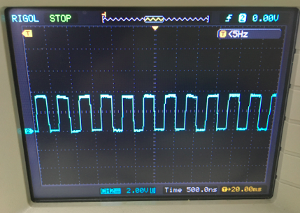
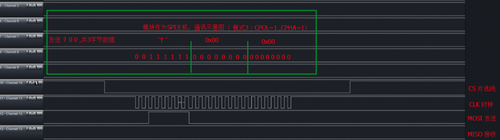
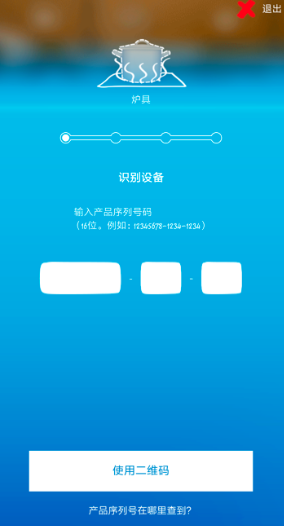
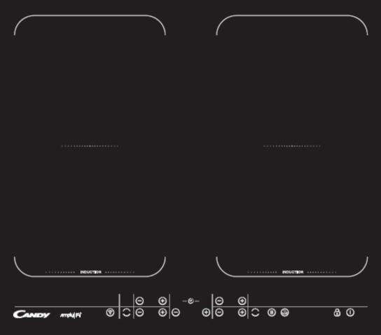

> Show_021

### 示波器：查看频率

* 

###  逻辑分析仪：抓取SPI通讯demo的波形图

* 

### APP界面展示

* 

### 效果图

* 

### SPI通信协议简单总结

* 一、SPI串行外围设备接口。是Motorola发明的。

* 二.SPI是一种高速的，全双工，同步的通信总线。

* 三.SPI特点：（主机Master—从机Slave）

* 四、SPI 的四根线：
    - 1、CS/SS（片选）
    - 2、CLK（时钟）
    - 3、MOSI（主机输出/从机输入）
    - 4、MISO（主机输入/从机输出）

* 五、SPI的四种传输模式
    - 模式0 ，模式1， 模式2 ，模式3 
    - 4种模式的由来：取决于 极性CPOL （Polarity） 和 相位CPHA （Phase）
    - CPOL和CPHA，分别都可以是0或时1，对应的四种组合就是：
       + Mode 0 ：CPOL=0, CPHA=0
       + Mode 1 ：CPOL=0, CPHA=1
       + Mode 2 ：CPOL=1, CPHA=0
       + Mode 3 ：CPOL=1, CPHA=1

* 六、备注
    - SPI数据的传输，没有读和写的说法，因为实质上每次SPI是主从设备在交换数据。
    - 也就是说，你发一个数据必然会收到一个数据；你要收一个数据必须也要先发一个数据。

